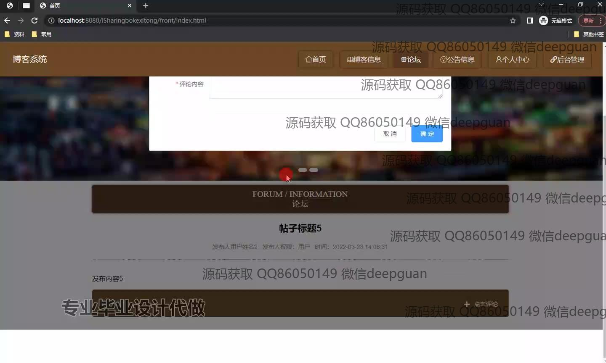

<h1 align="center">基于框架的博客系统的开发+vue</h1>

## 简介
博客系统：角色分为管理员、用户；实现博客信息管理、用户管理、论坛互动、评论管理、内容审核等功能；支持个性化信息编辑、分类搜索和后台管理，界面简洁交互友好。    --计算机毕业设计源码；毕设源码；java毕业设计源码

## 联系方式

<h3 align="center">获取完整代码与数据库文件 + 微信：deepguan QQ: 86050149 QQ群: 783742310</h3>

<h3 align="center">可帮忙远程部署 包运行成功！提供远程部署、修改代码、设计文档指导、代码讲解等服务！</h3>

## 功能介绍（完整见运行截图）
管理员：具备登录与信息管理功能，负责博客系统的总体管理。可以管理用户信息、查看和回复帖子详情、审核和管理博客内容，如新增或删除博客类型、审核博客文章等。可访问用户管理、博客类型管理等模块，并通过各类操作按钮对信息进行详细管理，确保系统运营顺畅。  
普通用户：可以注册、登录博客系统，参与论坛讨论、发表或回复帖子。能够浏览博客分类、用户收藏内容、编辑个人信息等。用户可以通过导航栏访问首页、博客信息、个人中心和论坛模块，与其他用户互动，提升平台活跃度。

## 运行截图

本代码来源于网络,仅供学习参考使用!

